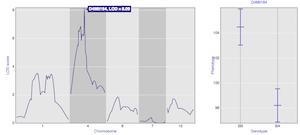
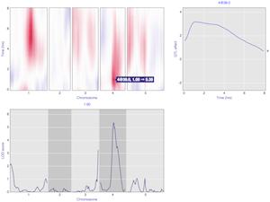
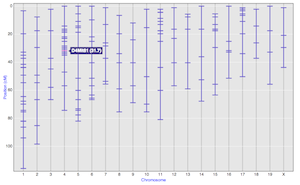

R/qtlcharts is an [R](http://www.r-project.org) package to create
[D3](http://d3js.org)-based interactive charts for xQTL data, for use
with the [R/qtl](http://www.rqtl.org) package.

A QTL is a _quantitative trait locus_: a genetic locus that
contributes to variation in a quantitative trait. There is
considerable recent interest in eQTL, which are QTL that affect gene
expression levels (ie, mRNA abundances), and also pQTL, which
influence protein levels, and mQTL, which influence
metabolites. There's a plethora of such terms for QTL influencing
genome-scale phenotypes; we refer to them collectively as xQTL. The
goal of R/qtlcharts is to provide interactive data visualizations xQTL
analyses, and to make these visualizations available from R.

The interactive visualizations are built with the JavaScript library
[D3](http://d3js.org), and are viewed in a web browser. We are
targeting Chrome and Safari and, as much as possible, Firefox.

A set of [reusable graphics panels](pages/panels.html) form the basis
for the larger visualizations.

---

|                                         |                               |                                      |                                              |
| :-------------------------------------: | :---------------------------: | :----------------------------------: | :------------------------------------------: |
| [Installation](pages/installation.html) | [User guide](pages/user.html) | Developer guide (<em>planned</em>)   | [Reusable graphic panels](pages/panels.html) |

---

### Example charts

Click on a chart for the corresponding interactive version.

<link href="assets/css/image_table.css" rel="stylesheet" />

|                                                                                                                   |                                                                                                       |
| :---------------------------------------------------------------------------------------------------------------: | :---------------------------------------------------------------------------------------------------: |
|     |  |
|  |     |
|        |     |

---

Sources on [github](http://github.com):

- The [source for the website](https://github.com/kbroman/qtlcharts/tree/gh-pages)
- The [source for the package](https://github.com/kbroman/qtlcharts/tree/master)
